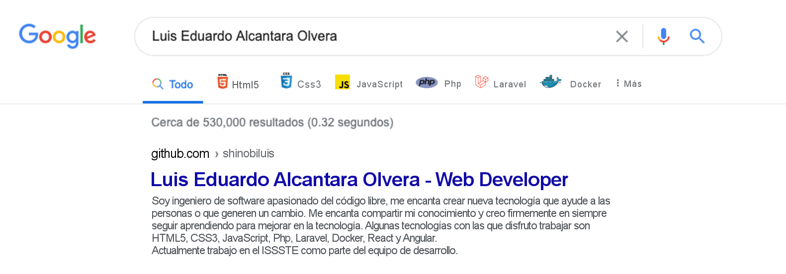

### Hola 👋 , soy Luis...!

Soy ingeniero de software apasionado del código libre, me encanta crear nuevas tecnología que ayuden a las personas o que generen un cambio. Me encanta compartir mi conocimiento y creo firmemente en siempre seguir aprendiendo para mejorar en la tecnología. Algunas tecnologías con las que disfruto trabajar son HTML5, CSS3, JavaScript, Php, Laravel, Docker, React y Angular. Actualmente trabajo en el ISSSTE como parte del equipo de desarrollo.

También puedes encontrarme en:

* [Linkedin](https://www.linkedin.com/in/geekluis/)
* [Instagram](https://www.instagram.com/geek_luis25/)

